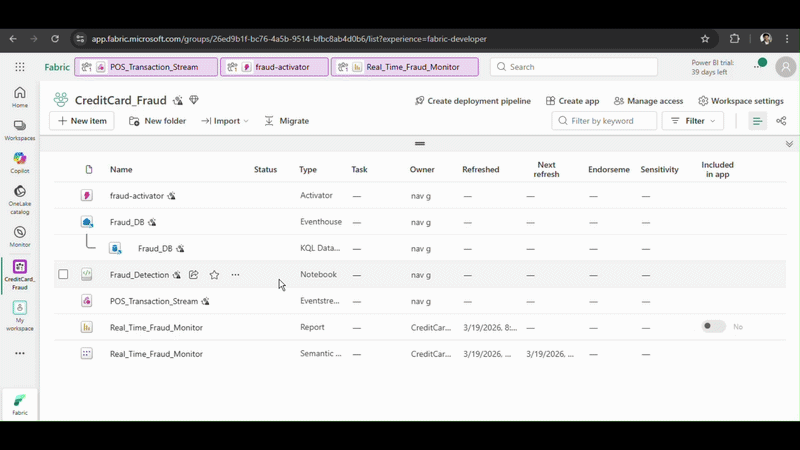

# Automated Email Reporting System



This project automates the end-to-end process of data extraction, storage, visualization, and stakeholder communication. It streamlines daily reporting by handling data pipelines and email delivery through Python.

## 📂 Project Structure
As shown in the repository:
* **charts/**: Stores generated analytical visualizations (PNG/JPG).
* **data/raw/**: Contains source files or raw datasets before processing.
* **database/**: Includes SQLite `.db` files and database schema scripts.
* **scripts/**: The core Python logic for automation and mail triggering.
* **.ipynb_checkpoints/**: Jupyter Notebook temporary files used during development.

---

## 🚀 Key Features
* **Automated Pipeline:** Fetches and cleans raw data from the `data/raw/` directory.
* **Persistent Storage:** Manages structured data using SQLite within the `database/` folder.
* **Data Visualization:** Automatically creates performance charts saved in `charts/`.
* **SMTP Integration:** Dispatches professional HTML emails with report attachments.

---

## 🛠️ Tech Stack
* **Language:** Python 3.x
* **Database:** SQLite
* **Libraries:** `pandas`, `matplotlib`, `smtplib`, `email.mime`, `sqlite3`

--

## 💻 Core Logic Overview

### 1. Database Management
The script connects to the local SQLite database to query the latest metrics:
```python
import sqlite3
import pandas as pd

def get_data():
    conn = sqlite3.connect('database/your_data.db')
    df = pd.read_sql_query("SELECT * FROM report_metrics", conn)
    conn.close()
    return df
